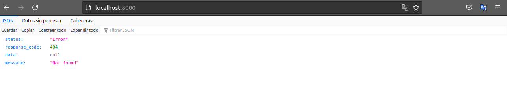

# Manual de instalación
| Atributo                | Descripción            |
| ----------------------- | ---------------------- |
| Autor del documento :   | Rober Sehuanez Jimenez |
| Fecha del documento :   | 12/07/2021             |
| Version del documento : | 1.0.0                  |

### Requisitos de instalación

<hr style="margin-bottom: 20px; margin-top:-10px; border: 0; border-top: 1px solid #000; ">

- Docker
- Docker compose


### Pasos de configuración

<hr style="margin-bottom: 20px; margin-top:-10px; border: 0; border-top: 1px solid #000; ">

A continuacion se detalla el paso a paso para poder poner en marcha las aplicaciones requeridas.

#### 1. Clonar repositorios 

Es recomendable destinar una carpeta de nuestro dispositivo para almacenar las aplicaciones que descargaremos a continuacion, caso que se despliegue sobre un ambiente pre-producción la ruta sera **/var/www/html/**. 

Nos ubicamos en la carpeta donde se descargara el proyecto, abrimos una terminal y ejecutamos el siguiente comando:

```bash
git clone https://github.com/sky98/posAPIlaravel.git
```

Descargamos las siguientes fuentes.

```bash
git clone https://github.com/sky98/posApiAngular.git
```


#### 2. Configuración laravel

##### 2.1 Configuración del .env

Accedes al directorio donde descargamos nuestro proyecto y copiamos el .env.example con un nuevo nombre.

```bash
cp .env.example .env
```

Abrimos el archivo anteriormente copiado ya sea con nano o con el editor de texto de su preferencia.

```bash
nano .env
```

Configuramos los parametros de conexion a la base de datos y los parametros de la app tales como el nombre y el puerto.

```bash
APP_NAME=laravelapp
APP_ENV=dev
APP_KEY=
APP_DEBUG=true
APP_URL=http://localhost:8000

LOG_CHANNEL=stack

DB_CONNECTION=mysql
DB_HOST=db
DB_PORT=3306
DB_DATABASE=reportlaravel
DB_USERNAME=laraveluser
DB_PASSWORD=password
...
```

Estos parametros son configurables en caso prefiera colocar ya sea otros nombres o cambiar los parametros de conexion a la base de datos.

##### 2.2 Creación de la imagen de la app

Para crear la imagen de la app usaremos el siguiente comando que se encarga de construir las imagenes necesarias para ejecutar nuestra aplicación.

```bash
docker-compose build app
```

Este comando se puede tardar unos cuantos minutos mientras se descargan las imagenes que necesitamos. La salida deberia ser similar a esta.

```bash
Building app
Step 1/11 : FROM php:7.4-fpm
 ---> fa37bd6db22a
Step 2/11 : ARG user
 ---> Running in f71eb33b7459
Removing intermediate container f71eb33b7459
 ---> 533c30216f34
Step 3/11 : ARG uid
 ---> Running in 60d2d2a84cda
Removing intermediate container 60d2d2a84cda
 ---> 497fbf904605
Step 4/11 : RUN apt-get update && apt-get install -y     git     curl     libpng-dev     libonig-dev     ...
Step 7/11 : COPY --from=composer:latest /usr/bin/composer /usr/bin/composer
 ---> e499f74896e3
Step 8/11 : RUN useradd -G www-data,root -u $uid -d /home/$user $user
 ---> Running in 232ef9c7dbd1
Removing intermediate container 232ef9c7dbd1
 ---> 870fa3220ffa
Step 9/11 : RUN mkdir -p /home/$user/.composer &&     chown -R $user:$user /home/$user
 ---> Running in 7ca8c0cb7f09
Removing intermediate container 7ca8c0cb7f09
 ---> 3d2ef9519a8e
Step 10/11 : WORKDIR /var/www
 ---> Running in 4a964f91edfa
Removing intermediate container 4a964f91edfa
 ---> 00ada639da21
Step 11/11 : USER $user
 ---> Running in 9f8e874fede9
Removing intermediate container 9f8e874fede9
 ---> fe176ff4702b

Successfully built fe176ff4702b
Successfully tagged travellist:latest
```

Cuando este proceso termine pasaremos ahora a ejecutar nuestros contenedores en segundo plano con la siguiente instrucción.

```bash
docker-compose up -d
```

La respuesta del anterior comando sera la siguiente :

```bash
Creating travellist-db    ... done
Creating travellist-app   ... done
Creating travellist-nginx ... done
```

Para verificar que todo este correcto ejecutamos el siguiente comando:

```bash
docker-compose ps
```

Y el resultado debería ser el siguiente:

```bash
     Name                    Command              State          Ports        
-------------------------------------------------------------------------------
laravel-app     docker-php-entrypoint php-fpm   Up      9000/tcp            
app-db      	docker-entrypoint.sh mysqld     Up      3306/tcp, 33060/tcp
app-nginx   	nginx -g daemon off;            Up      0.0.0.0:8000->80/tcp
```

Para terminar de preparar nuestra app y visualizarla en el navegador ejecutamos los siguientes comando:

Instala las dependencias.

```bash
docker-compose exec app composer install
```

Genera un key unica del proyecto

```bash
docker-compose exec app php artisan key:generate
```

y ya con esto podemos visualizar un resultado en nuestro navegador.



Aqui ya la app esta respondiendo, con una respuesta en json personalizada.


##### 2.3 Configuración MySQL

Antes que nada hayq ue mencionar que la configuración diseñada para esta guía crea por defecto el usuario **root** que tiene todos los permisos del servidor de la base de datos, es recomendable evitar esto y preferible crear un usuario para la comunicacion con laravel que no tenga todos estos permisos.

Para ingresar a la consola de MySQL ejecutamos el siguiente comando 

```bash
docker-compose exec db bash
```

Estando ya dentro del contenedor, ingresamos lo siguiente

```bash
mysql -u root -p
```

El cual nos pedira la contraseña de ingreso la cual es **password**, como nosotros lo habiamos definido tanto en el .env de la app como en el Dockerfile  del proyecto.

Una vez logeados en MySQL verificamos que la base de datos (DB) para la app este creado con el siguiente comando:

```bash
show databases;
```


##### 2.4 Migraciones y seeder

Despues de haber comprobado que la DB estaba creada, vamos a crear las tablas y poblar nuestras tablas con datos de prueba por medio de los seeders. Para hacer esto ejecutamos el siguiente comando:

```php
docker-compose exec app php artisan migrate --seed
```

En este punto ya hemos descargado la app, configurado, desplegado y poblado nuestra DB con datos de prueba.


#### 3. Configuración angular

